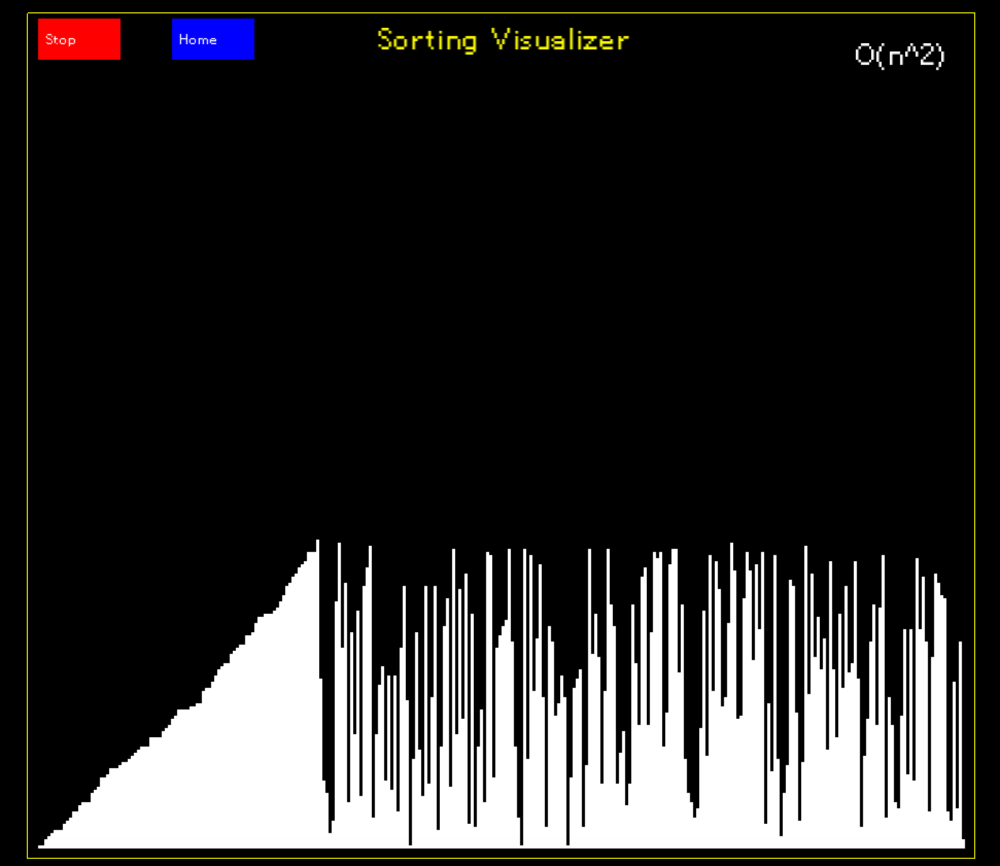

ALGO-VISUALIZER 😎
===================================

The algo-visualizer is a tool to visualize the execution of algorithms. More specifically, for sorting algorithms. The visualizer is written in C++ and uses the SFML library for rendering.

There are two two different implementations of the visualizer:

1. A complete visualizer UI that gives access to visualization of the most common sorting algorithms, along with their time complexity, the ability to go back and forth in the visualization, and to stop and start the visualization.
2. A generic visualizer that can be used to visualize any algorithm that can be represented as a sequence of states. The states are captured using a lambda function that returns the current state of the algorithm at each iteration.

Installation
------------
The libraries and executables are written in C++ and don't require a specific C++ flag to be excuted. All dependencies can be installed using the provided conda environment:

.. code-block:: bash

    conda env create -f environment.yml
    conda activate visualizer

To build the visualizer, run the following commands:

.. code-block:: bash

    mkdir build
    cd build
    cmake ..
    cmake --build .

There will be two executables in the build directory: `main_visualizer` and `main_generic`. The first one is the complete visualizer UI, and the second one is the generic visualizer.

Usage
-----
To run the visualizer, execute the following command:

.. code-block:: bash

	./build/bin/main_visualizer

The visualizer will open a window with different options to visualize the sorting algorithms.

To run the generic visualizer, execute the following command:

.. code-block:: bash

	./build/bin/main_generic

To visualize a different algorithm, you can modify the main_visualizer.cpp file and change the sorting algorithm to be visualized. Pass your own, as long as a lambda function can be used to capture the state of the algorithm at each iteration.

Documentation
-------------
The documentation is written using Sphinx and can be found in the `docs` directory.

.. toctree::
   :maxdepth: 2
   :caption: Contents:

   docu